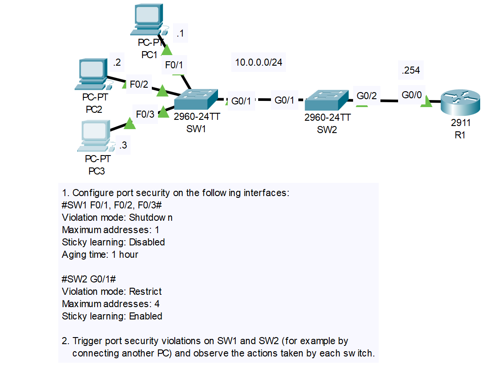

# Topology & Tasks
Source: Jeremy's IT Lab

# 1
Note: 
- Port Security can only enable on a trunk or access port.
- By default: Violation mode is shutdown and Sticky learning is disable! So, We don't need to config them in this case!
  
## SW1: f0/1 - f0/3
***
    SW1>en
    SW1#config t
    Enter configuration commands, one per line.  End with CNTL/Z.
    SW1(config)#int range f0/1-f0/3
    SW1(config-if-range)#sw port-security
    Command rejected: FastEthernet0/1 is a dynamic port.
    Command rejected: FastEthernet0/2 is a dynamic port.
    Command rejected: FastEthernet0/3 is a dynamic port.

***
    SW1(config-if-range)#sw mode access
    SW1(config-if-range)#sw port-security

    SW1(config-if-range)#sw port-security aging ?
      time  Port-security aging time	
    SW1(config-if-range)#sw port-security aging time ?
      <1-1440>  Aging time in minutes. Enter a value between 1 and 1440
    SW1(config-if-range)#sw port-security aging time 60

    SW1(config-if-range)#sw port-security maximum ?
    <1-132>  Maximum addresses
    SW1(config-if-range)#sw port-security maximum 1
    SW1(config-if-range)#

### Verify
Example: f0/1

    SW1#show port-security int f0/1
    Port Security              : Enabled
    Port Status                : Secure-up
    Violation Mode             : Shutdown
    Aging Time                 : 60 mins
    Aging Type                 : Absolute
    SecureStatic Address Aging : Disabled
    Maximum MAC Addresses      : 1
    Total MAC Addresses        : 0
    Configured MAC Addresses   : 0
    Sticky MAC Addresses       : 0
    Last Source Address:Vlan   : 0000.0000.0000:0
    Security Violation Count   : 0

## SW2: g0/1

    SW2(config)#int g0/1
    SW2(config-if)#sw port-security 
    Command rejected: GigabitEthernet0/1 is a dynamic port.
    SW2(config-if)#sw mode trunk
    
    SW2(config-if)#
    %LINEPROTO-5-UPDOWN: Line protocol on Interface GigabitEthernet0/1, changed state to down
    
    %LINEPROTO-5-UPDOWN: Line protocol on Interface GigabitEthernet0/1, changed state to up

    SW2(config-if)#sw port-security 

G0/1 of SW1 is a trunk port => G0/1 of SW2 should be a trunk! That was why I configured it as a trunk!
***
    SW2(config-if)#sw port-security violation ?
      protect   Security violation protect mode
      restrict  Security violation restrict mode
      shutdown  Security violation shutdown mode
    SW2(config-if)#sw port-security violation restrict
    
    SW2(config-if)#sw port-security maximum 4
    
    SW2(config-if)#sw port-security mac-address ?
      H.H.H   48 bit mac address
      sticky  Configure dynamic secure addresses as sticky
    SW2(config-if)#sw port-security mac-address sticky
    SW2(config-if)#

### Verify
    SW2#show port-security int g0/1
    Port Security              : Enabled
    Port Status                : Secure-up
    Violation Mode             : Restrict
    Aging Time                 : 0 mins
    Aging Type                 : Absolute
    SecureStatic Address Aging : Disabled
    Maximum MAC Addresses      : 4
    Total MAC Addresses        : 0
    Configured MAC Addresses   : 0
    Sticky MAC Addresses       : 0
    Last Source Address:Vlan   : 0000.0000.0000:0
    Security Violation Count   : 0

  If you ping from PCs to R1 (10.0.0.254), the sticky MAC addresses of SW2 will be 4 because 3 PCs = 3 MAC, SW1 = 1 MAC.

    SW2#show port-security int g0/1
    Port Security              : Enabled
    Port Status                : Secure-up
    Violation Mode             : Restrict
    Aging Time                 : 0 mins
    Aging Type                 : Absolute
    SecureStatic Address Aging : Disabled
    Maximum MAC Addresses      : 4
    Total MAC Addresses        : 4
    Configured MAC Addresses   : 0
    Sticky MAC Addresses       : 4
    Last Source Address:Vlan   : 0003.0003.0003:1
    Security Violation Count   : 0

## 2
Check:

    SW2#show port-security
    Secure Port MaxSecureAddr CurrentAddr SecurityViolation Security Action
                   (Count)       (Count)        (Count)
    --------------------------------------------------------------------
           Gig0/1        4          4                 0         Restrict
    ----------------------------------------------------------------------
    SW2#

Trigger:
- SW1, Configure (SVI - Switch Virtual Int) int Vlan1 IP address - 10.0.0.10 255.255.255.0 = a new MAC address
